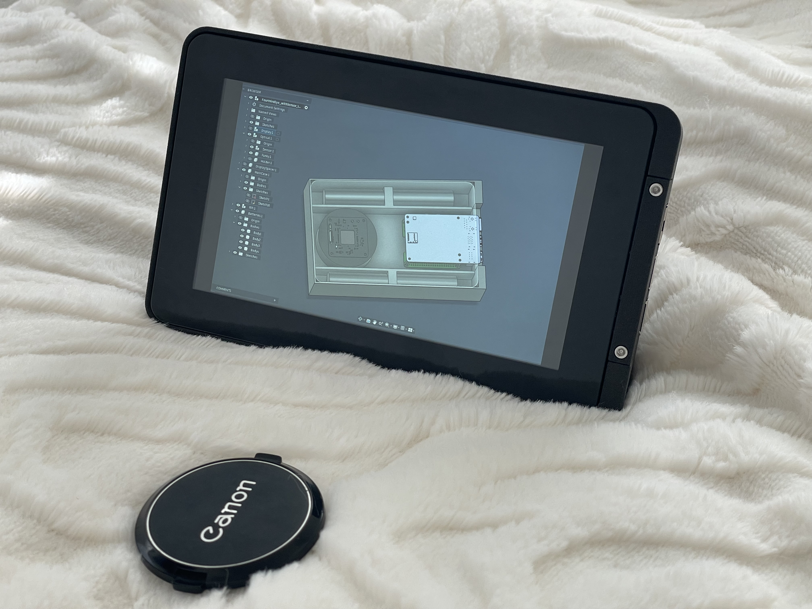
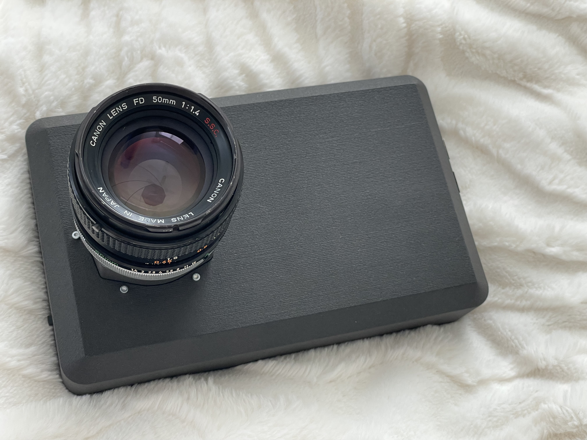

# Field Imaging Rig

A reproducible, handheld scientific imaging reference design built from off-the-shelf components. This project focuses on physical constraints, open CAD, and intent‑preserving design from concept through manufactured reality.

The image above shows the internal design and component layout as developed in CAD and carried through to fabrication. This view represents the architectural intent of the system rather than a live CAD session running on the device itself.

---

## Overview

This repository contains the mechanical design, bill of materials, and assembly references for a small, self‑contained scientific imaging rig. The system is designed to support 12‑bit RAW capture, battery‑powered operation, and direct human interaction via a touchscreen interface.

The primary goal of this project is **architectural clarity and reproducibility**, not productization. It serves as a concrete reference for designing physical systems where mechanical, electrical, optical, and usability constraints must agree without interpretation.

---

## Design Philosophy

A few principles guided this work:

* **Constraints over geometry**
  The CAD emphasizes tolerances, assembly order, serviceability, and negative space rather than compactness or visual minimalism.

* **Reproducibility over optimization**
  All major subsystems are based on readily available components to reduce hidden assumptions and enable inspection, reuse, and modification.

* **Intent preservation**
  The goal is not to generate shapes, but to encode design intent explicitly enough that it survives manufacturing, assembly, and future changes.

* **Open validation**
  Publishing the full design is treated as an extension of validation. If others can rebuild or adapt the system without implicit knowledge, the architecture is doing its job.

---

## Repository Structure

* The `CAD` directory contains a single STEP file representing the complete assembled system, along with individual STL files ready for fabrication.
* The `media` directory contains images used for documentation and assembly reference.

---

## Bill of Materials (BOM)

The reference configuration uses the following major components:

* **Compute:** Raspberry Pi 5
* **NVMe Interface:** Raspberry Pi 5 Official NVMe HAT
* **Storage:** PCIe NVMe SSD (compatible with Raspberry Pi 5 NVMe HAT)
* **Cooling:** Raspberry Pi 5 Official Active Cooler
* **Power:** Waveshare UPS HAT E (5 V / 6 A budget)
  [https://www.waveshare.com/ups-hat-e.htm](https://www.waveshare.com/ups-hat-e.htm)
* **Display:** Raspberry Pi Display 2.0 with touch
* **Image Sensor:** FourThirdEye (reference configuration)
* **Connectivity:** Ethernet, USB (via Raspberry Pi)
* **Mechanical:** 3D‑printed enclosure parts (see `CAD/`)

All major subsystems are intentionally based on off‑the‑shelf components to reduce hidden assumptions and improve reproducibility. Where appropriate, components may be substituted provided electrical, thermal, and mechanical constraints are respected.

---

## Assembly Notes

A simplified assembly guide is supported by the images in the `media/` directory. These notes are intentionally minimal and expected to evolve.

The high‑level assembly sequence is:

1. Mechanical enclosure preparation
2. Power subsystem installation
3. Compute, cooling, and NVMe integration
4. Display and interface mounting
5. Sensor and optical alignment
6. Final enclosure closure and validation

The reference build was assembled without shims, rework, or post‑fit adjustments.

---

## Physical Validation

The assembled reference build shown above corresponds directly to the published design files and was validated through physical assembly and use rather than visual inspection alone.

---

## Status

* Mechanical design: **validated**
* Physical assembly: **validated**
* Electrical integration: **validated**
* Software stack: **evolving**

Future work may explore alternative software stacks (including mobile‑friendly OS variants) to further improve handheld usability and camera support.

---

## A Note on AI and CAD

AI tools were useful during early exploration and trade‑space analysis. However, the final design relies heavily on judgment embedded in constraints, tolerances, assembly order, and negative space. These aspects remain difficult to externalize or automate reliably and are intentionally left visible in the CAD.

---

## License and Use

This project is released under the MIT License and shared openly for learning, inspection, and reuse. It is not positioned as a commercial product.

If you adapt or extend the design, feedback on which constraints broke first is particularly welcome.

---

## Contact

Questions, adaptations, and architectural discussions are welcome. This repository is intended as a living reference rather than a finished artifact.

